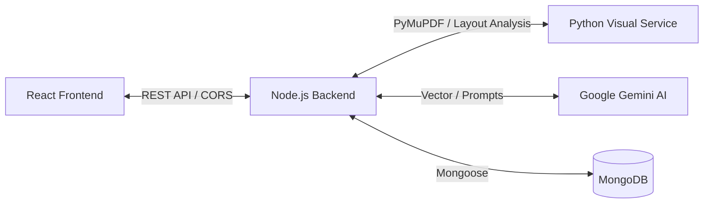

<div align="center">

# 📄 DocuAssess AI Engine 2.0

**Enterprise-Grade AI Assessment Generation Platform**

[](https://reactjs.org/)
[](https://nodejs.org/)
[](https://python.org/)
[](https://ai.google.dev/)
[](#license)

</div>

---

## 🌟 Overview

**DocuAssess AI** is an advanced, automated assessment creation suite designed for educators, corporate trainers, and institutions. By leveraging state-of-the-art Large Language Models (Google Gemini) and a sophisticated document parsing engine, it transforms raw PDF textbooks, manuals, and documentation into structured, print-ready examination papers in seconds.

Our proprietary **Visual-Context Engine** not only analyzes text but intelligently extracts, crops, and associates diagrams and charts from your PDFs to generate complex, multi-modal questions (e.g., diagram-based MCQs, graph analysis).

---

## ✨ Key Features

- **🧠 Deep Semantic Analysis**: Extracts concepts, definitions, and relationships from unstructured PDF text.
- **🖼️ Intelligent Visual Extraction**: Automatically detects charts, graphs, and diagrams using a dedicated Python-based layout analysis microservice.
- **📝 Multi-Modal Question Types**: Generates True/False, Multiple Choice, Fill in the Blanks, Diagram Analysis, and Open-Ended questions.
- **⚡ Real-time Processing**: Streamed architecture ensures feedback and progress updates during the AI generation cycle.
- **🖨️ Print-Ready Export**: Beautiful, MNC-standard PDF exporting capabilities tailored for academic and corporate printing.

---

## 🏗️ Architecture Stack

The platform is built on a scalable, decoupled microservices architecture:



### Core Technologies
* **Frontend:** React, Vite, Vanilla CSS (Glassmorphism UI UI)
* **Backend:** Node.js, Express, Multer, Mongoose
* **AI & Document Service:** Python, FastAPI, PyMuPDF, Unstructured
* **Database:** MongoDB
* **LLM Provider:** Google Gemini Pro

---

## 🚀 Getting Started

Follow these instructions to set up the DocuAssess AI suite locally.

### Prerequisites
* **Node.js** (v18 or higher)
* **Python** (v3.10 or higher)
* **MongoDB** (Local instance or Atlas URI)
* **Google Gemini API Key**

### 1. Clone the Repository
```bash
git clone https://github.com/Aditya-Kapde/DocuAssess-AI.git
cd DocuAssess-AI
```

### 2. Environment Setup

Create `.env` files in the root of the backend, frontend, and python-service directories based on the `.env.example` configurations.

**`docuassess-backend/.env`**
```env
PORT=5001
CORS_ORIGIN=http://localhost:3000
MONGODB_URI=mongodb://localhost:27017/docuassess
GEMINI_API_KEY=your_gemini_api_key_here
PYTHON_SERVICE_URL=http://localhost:8001
```

**`docuassess-frontend/.env`**
```env
VITE_API_BASE=http://localhost:5001/api/v1
```

### 3. Run the Services

You will need three terminal instances to run the services concurrently:

**Terminal 1: Node.js Backend**
```bash
cd docuassess-backend
npm install
npm run dev
```

**Terminal 2: React Frontend**
```bash
cd docuassess-frontend
npm install
npm run dev
```

**Terminal 3: Python Visual Service**
```bash
cd python-service
python -m venv venv
source venv/bin/activate # Windows: .\venv\Scripts\activate
pip install -r requirements.txt
uvicorn app:app --reload --port 8001
```

Access the web interface at `http://localhost:3000`.

---

## 🤝 Contributing

We welcome contributions! Please follow our standard fork-and-pull request workflow:
1. Fork the project
2. Create your feature branch (`git checkout -b feature/AmazingFeature`)
3. Commit your changes (`git commit -m 'Add some AmazingFeature'`)
4. Push to the branch (`git push origin feature/AmazingFeature`)
5. Open a Pull Request

---

## 📜 License

Distributed under the MIT License. See `LICENSE` for more information.

<div align="center">
  <sub>Built with ❤️ by the DocuAssess Team</sub>
</div>
