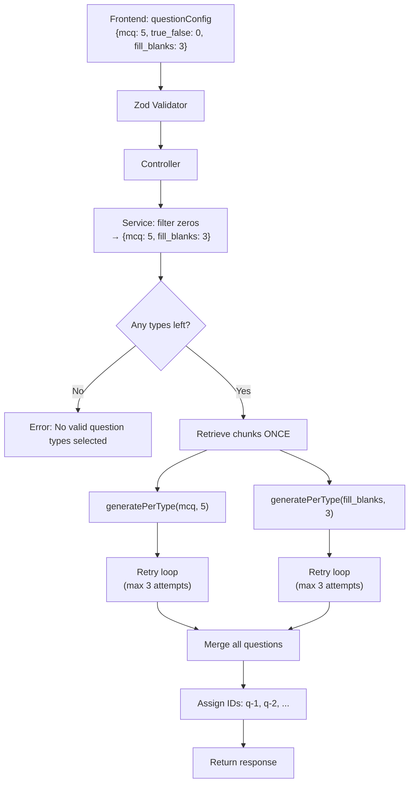

# Refactor: Per-Question-Type Counts

Replace the global `count` parameter with a `questionConfig` object that specifies an independent count per question type. Each type is generated via a separate AI call with retry-on-shortage logic. Zero-count types are silently skipped.

## User Review Required

> [!IMPORTANT]
> **API Contract Change** — The request body changes from `{ fileId, questionTypes, count }` to `{ fileId, questionConfig }`. This is a breaking change for any existing API consumers. The frontend will be updated simultaneously.

> [!WARNING]
> **Frontend UX Change** — The single "Count per type" slider is replaced with individual sliders per selected question type. This changes the configuration UI.

---

## Design Decisions

### Zero-Count Strategy

Zero-count types are handled by **filtering at the service layer**, not at the Zod schema level:

```
questionConfig: { mcq: 5, true_false: 0, fill_blanks: 3 }
                          ↓ filter at service layer
effective config: { mcq: 5, fill_blanks: 3 }
```

- The validator accepts `0` values (schema uses `.min(0)` instead of `.min(1)`)
- The service filters out zero-count entries **before** entering the generation pipeline
- Zero-count types never touch the prompt builder, AI service, or normalizer
- If **all** types are zero → the service returns a clear error: `"No valid question types selected"`

### Scalability Constant

A single `MAX_QUESTIONS_PER_TYPE` constant is defined in the validator and referenced everywhere counts are bounded. No behavioral change — just makes future limit changes a one-line edit.

---

## Proposed Changes

### Backend — Input Validation

#### [MODIFY] [generate.validator.js](file:///d:/Ellipsonic%20projects/DocuAssess%20AI/docuassess-backend/src/validators/generate.validator.js)

```diff
+ const MAX_QUESTIONS_PER_TYPE = 20;
+
  const generateRequestSchema = z.object({
    fileId: z.string().uuid(),
-   questionTypes: z.array(z.enum(validQuestionTypes)).min(1).max(6),
-   count: z.number().int().min(1).max(20),
+   questionConfig: z.record(
+     z.enum(validQuestionTypes),
+     z.number().int().min(0).max(MAX_QUESTIONS_PER_TYPE)
+   )
+   .refine(obj => Object.keys(obj).length >= 1, 'At least one question type is required')
+   .refine(obj => Object.keys(obj).length <= 6, 'Maximum 6 question types allowed'),
  });
+
+ module.exports = { generateRequestSchema, MAX_QUESTIONS_PER_TYPE };
```

Key points:
- `min(0)` — allows zero counts to pass validation (filtered later)
- `MAX_QUESTIONS_PER_TYPE` — single source of truth, exported for reuse
- Validates that keys are valid question types (via `z.enum`)
- Validates 1–6 type keys present in the object
- Does **NOT** validate whether all values are zero — that's the service's job

---

### Backend — Controller

#### [MODIFY] [generate.controller.js](file:///d:/Ellipsonic%20projects/DocuAssess%20AI/docuassess-backend/src/controllers/generate.controller.js)

```diff
  const generate = async (req, res, next) => {
-   const { fileId, questionTypes, count } = req.body;
+   const { fileId, questionConfig } = req.body;

    try {
      const result = await generateQuestions({
        fileId,
-       questionTypes,
-       count,
+       questionConfig,
      });
```

Minimal change — just passes the new shape through. Zero-count filtering happens in the service.

---

### Backend — Core Service (major refactor)

#### [MODIFY] [generate.service.js](file:///d:/Ellipsonic%20projects/DocuAssess%20AI/docuassess-backend/src/services/generate.service.js)

This is the main file being refactored. Two functions:

##### 1. New: `generatePerType({ chunkContents, type, count })`

Generates questions for a single type with retry-on-shortage:

```js
const MAX_RETRIES = 3;

const generatePerType = async ({ chunkContents, type, count }) => {
  let accumulated = [];
  let attempts = 0;
  let lastMeta = null;

  while (accumulated.length < count && attempts < MAX_RETRIES) {
    attempts++;
    const remaining = count - accumulated.length;

    // Build single-type prompt
    const { prompt, usedChunks, truncated } = buildPrompt({
      chunkContents,
      questionSpec: [{ type, count: remaining }],
    });

    // Call AI
    const aiResult = await generateFromPrompt(prompt);
    if (!aiResult.success) throw { ...aiResult }; // propagate error

    // Validate + normalize
    const { validatedQuestions, validationMeta } = validateAndNormalize(
      aiResult.data,
      [{ type, count: remaining }]
    );

    const valid = validatedQuestions[type] || [];
    accumulated.push(...valid);
    lastMeta = { ...validationMeta, attempts, retried: aiResult.retried };

    if (valid.length >= remaining) break; // got enough
    logger.warn(`[generatePerType] "${type}": attempt ${attempts} yielded ${valid.length}/${remaining}, retrying...`);
  }

  // Trim if over
  if (accumulated.length > count) {
    accumulated = accumulated.slice(0, count);
  }

  return { type, questions: accumulated, meta: lastMeta };
};
```

##### 2. Refactored: `generateQuestions({ fileId, questionConfig })`

```js
const generateQuestions = async ({ fileId, questionConfig }) => {
  // ── Filter out zero-count types ──
  const effectiveConfig = Object.fromEntries(
    Object.entries(questionConfig).filter(([_, count]) => count > 0)
  );

  // ── Safety: all zeros ──
  if (Object.keys(effectiveConfig).length === 0) {
    return {
      success: false,
      questions: null,
      meta: { /* ... */ },
      errorCode: 'NO_VALID_TYPES',
      error: 'No valid question types selected',
    };
  }

  // ── Retrieve context ONCE (shared) ──
  const { contents, totalChunks } = await retrieveContext(fileId);
  // ... existing empty-check ...

  // ── Generate per type (sequential) ──
  const allQuestions = [];
  const perTypeMeta = {};

  for (const [type, count] of Object.entries(effectiveConfig)) {
    const result = await generatePerType({
      chunkContents: contents,
      type,
      count,
    });
    // Tag each question with its type
    result.questions.forEach(q => allQuestions.push({ ...q, type }));
    perTypeMeta[type] = result.meta;
  }

  // ── Assign globally unique IDs AFTER merge ──
  allQuestions.forEach((q, i) => { q.id = `q-${i + 1}`; });

  return {
    success: true,
    questions: allQuestions,
    meta: { totalChunks, perType: perTypeMeta },
    errorCode: null,
    error: null,
  };
};
```

##### Zero-count flow:

| Input | Behavior |
|-------|----------|
| `{ mcq: 5, true_false: 0 }` | Generates 5 MCQs only. `true_false` silently skipped. |
| `{ mcq: 0, true_false: 0 }` | Returns error: `"No valid question types selected"` |
| `{ mcq: 5 }` | Generates 5 MCQs. Normal flow. |

---

### Backend — Prompt Builder

#### [MODIFY] [promptBuilder.js](file:///d:/Ellipsonic%20projects/DocuAssess%20AI/docuassess-backend/src/utils/promptBuilder.js)

Only the prompt template text changes — add strict count enforcement wording:

```diff
  ════════════════════════════════════════
  GENERATION TASK
  ════════════════════════════════════════
- Generate the following from the CONTEXT above:
+ Generate EXACTLY the following from the CONTEXT above. No more, no less.
  ${questionSpecBlock}
+
+ You MUST generate EXACTLY the specified number of questions for each type.
+ Generating fewer or more than the requested count is a violation.
```

No structural changes. The existing `buildPrompt()` already accepts `questionSpec: [{ type, count }]` for single-type calls.

---

### Files NOT Modified (per requirements)

| File | Reason |
|------|--------|
| [output.validator.js](file:///d:/Ellipsonic%20projects/DocuAssess%20AI/docuassess-backend/src/validators/output.validator.js) | Existing Zod schemas — DO NOT MODIFY |
| [ai.service.js](file:///d:/Ellipsonic%20projects/DocuAssess%20AI/docuassess-backend/src/services/ai.service.js) | Existing Gemini API wrapper — DO NOT MODIFY |
| [outputNormalizer.js](file:///d:/Ellipsonic%20projects/DocuAssess%20AI/docuassess-backend/src/utils/outputNormalizer.js) | Existing validation pipeline — DO NOT MODIFY |
| [pdf.service.js](file:///d:/Ellipsonic%20projects/DocuAssess%20AI/docuassess-backend/src/services/pdf.service.js) | PDF processing — DO NOT MODIFY |
| [rag.service.js](file:///d:/Ellipsonic%20projects/DocuAssess%20AI/docuassess-backend/src/services/rag.service.js) | RAG retrieval — DO NOT MODIFY |
| [chunk.service.js](file:///d:/Ellipsonic%20projects/DocuAssess%20AI/docuassess-backend/src/services/chunk.service.js) | Chunking — DO NOT MODIFY |

---

### Frontend — State Management

#### [MODIFY] [AppContext.jsx](file:///d:/Ellipsonic%20projects/DocuAssess%20AI/docuassess-frontend/src/context/AppContext.jsx)

Replace dual state (`selectedTypes[]` + `countPerType: number`) with unified `questionConfig: {}`:

```diff
  const initialState = {
    fileId: null,
    fileMeta: null,
-   selectedTypes: [],
-   countPerType: 5,
+   questionConfig: {},    // e.g. { mcq: 5, true_false: 3 }
    results: null,
    loading: false,
    error: null,
  };
```

State operations:

| Action | Before | After |
|--------|--------|-------|
| Toggle type ON | `selectedTypes.push(type)` | `questionConfig[type] = 5` (default) |
| Toggle type OFF | `selectedTypes.filter(...)` | `delete questionConfig[type]` |
| Change count | `countPerType = n` | `questionConfig[type] = n` |
| Derived `selectedTypes` | Direct state | `Object.keys(questionConfig)` |

New convenience functions:
- `toggleType(type)` — adds with default count or removes
- `setTypeCount(type, count)` — updates count for a specific type

---

### Frontend — Configuration UI

#### [MODIFY] [ConfigurePage.jsx](file:///d:/Ellipsonic%20projects/DocuAssess%20AI/docuassess-frontend/src/pages/ConfigurePage.jsx)

- Replace single `<SliderInput>` with per-type sliders (rendered for each selected type)
- Pass `questionConfig` directly to API call

```jsx
{selectedTypes.map(type => (
  <SliderInput
    key={type}
    label={QUESTION_TYPE_LABELS[type]}
    value={questionConfig[type]}
    onChange={(val) => setTypeCount(type, val)}
  />
))}
```

#### [MODIFY] [SliderInput.jsx](file:///d:/Ellipsonic%20projects/DocuAssess%20AI/docuassess-frontend/src/components/SliderInput.jsx)

Add optional `label` prop for per-type labeling:

```diff
- export default function SliderInput({ value, onChange, min = 1, max = 20 }) {
+ export default function SliderInput({ value, onChange, min = 1, max = 20, label = 'Count per type' }) {
    // ... existing JSX, replace hardcoded "Count per type" with {label}
```

---

### Frontend — API Client

#### [MODIFY] [client.js](file:///d:/Ellipsonic%20projects/DocuAssess%20AI/docuassess-frontend/src/api/client.js)

```diff
- export async function generateQuestions({ fileId, questionTypes, count }) {
-   body: JSON.stringify({ fileId, questionTypes, count }),
+ export async function generateQuestions({ fileId, questionConfig }) {
+   body: JSON.stringify({ fileId, questionConfig }),
```

---

### Backend — Error Status Map Update

#### [MODIFY] [generate.controller.js](file:///d:/Ellipsonic%20projects/DocuAssess%20AI/docuassess-backend/src/controllers/generate.controller.js)

Add the new error code for the all-zeros case:

```diff
  const ERROR_STATUS_MAP = {
    CHUNKS_NOT_FOUND: 404,
    API_CALL_FAILED: 502,
    RETRY_API_CALL_FAILED: 502,
    PARSE_FAILED: 422,
+   NO_VALID_TYPES: 400,
  };
```

---

## Scalability: `MAX_QUESTIONS_PER_TYPE`

The constant is defined **once** in `generate.validator.js` and exported:

```
generate.validator.js  →  defines & exports MAX_QUESTIONS_PER_TYPE = 20
                          uses it in Zod .max(MAX_QUESTIONS_PER_TYPE)
```

Future: To change the limit, update one constant. No behavioral change now — purely structural.

---

## Complete Data Flow



---

## Verification Plan

### Automated Tests
- Start backend dev server, test with `curl`/Postman
- Test cases:
  - Normal: `{ mcq: 5, true_false: 3 }` → 8 questions
  - Zero-skip: `{ mcq: 5, true_false: 0 }` → 5 MCQs only
  - All-zeros: `{ mcq: 0, true_false: 0 }` → 400 error
  - Single type: `{ mcq: 10 }` → 10 MCQs
  - Invalid type key → Zod 400

### Manual Verification
- Test frontend UI: toggle types, adjust individual sliders
- Verify generated questions have unique IDs and correct types
- Check logs for retry behavior when AI under-generates
- Confirm zero-count types don't appear in API response
